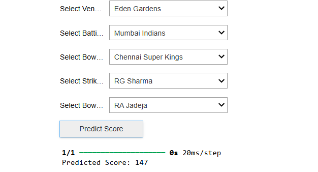
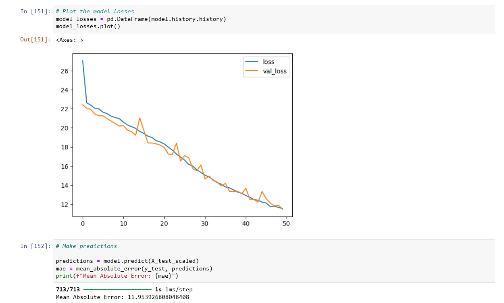

# IPL Score Prediction

This repository contains a machine learning project for predicting IPL (Indian Premier League) cricket scores based on historical data. The goal of this project is to build a regression model that can accurately predict the total score of a cricket team based on various features such as venue, batting team, bowling team, batsmen, and bowlers.



## Project Overview

In this project, we have used a dataset ([ipl_data.csv](ipl_data.csv)) containing various features related to IPL matches, including:

- Venue
- Batting Team
- Bowling Team
- Batsmen
- Bowlers
- Runs scored
- Wickets taken
- Overs played
- Runs and wickets in the last 5 overs

The main steps involved in this project are:

1. **Data Preprocessing**:
   - Cleaning and preparing the dataset.
   - Encoding categorical variables using LabelEncoder.
   - Scaling numerical features using MinMaxScaler.

2. **Model Building**:
   - Utilizing Keras (with TensorFlow backend) to build a neural network model.
   - Experimenting with different architectures (number of layers, units per layer) to optimize performance.
   - Training the model using historical IPL data.

3. **Evaluation**:
   - Assessing the model's performance using metrics such as Mean Absolute Error (MAE), Mean Squared Error (MSE), and R-squared (R2) score.
   - Iteratively refining the model to achieve better predictive accuracy.

4. **Prediction**:
   - Implementing prediction functionality using the trained model.
   - Creating an interactive prediction interface using `ipywidgets` for selecting venue, batting team, bowling team, batsman, and bowler.

5. **Comparison with Other Models**:
   - Implementing Gradient Boosting Regressor and Support Vector Regressor from scikit-learn for benchmarking and comparing performance.

## Results

After experimenting with various neural network architectures and model configurations, the final model achieved the following performance metrics on the test dataset:

- Mean Absolute Error (MAE): 11.95
- Mean Squared Error (MSE): 344.24
- R-squared (R2) Score: 0.592

These metrics indicate that the model is able to predict IPL scores with a high degree of accuracy, explaining approximately 59.2% of the variance in the data.



## Repository Structure

- `ipl_dataset.csv`: Dataset used for training and evaluation.
- `IPLScore.ipynb`: Jupyter notebook containing the entire project code with explanations.
- `requirements.txt`: List of Python dependencies required to run the project.
- `README.md`: This file, providing an overview of the project, instructions, and results.

## Usage

To run the project locally, follow these steps:

1. Clone the repository:
   ```
   git clone https://github.com/arindal/IPL-score-pred.git
   cd IPL-score-pred
   ```

2. Install dependencies:
   ```
   pip install -r requirements.txt
   ```

3. Open and run the `IPLScore.ipynb` notebook in Jupyter or any compatible environment.

4. Follow the instructions in the notebook to preprocess the data, build and train the model, and evaluate its performance.

5. Use the provided interactive widgets to make predictions based on custom inputs.

## Future Improvements

- Explore more advanced neural network architectures (e.g., LSTM for sequence data).
- Incorporate additional features such as player statistics, weather conditions, or match history.
- Conduct more thorough hyperparameter tuning and model optimization.
- Deploy the model as a web application or API for real-time predictions.

## Contact

- [Twitter](https://twitter.com/arindal_17)
- [GitHub](https://github.com/arindal1)
- [LinkedIn](https://www.linkedin.com/in/arindalchar)

## License

This project is licensed under the MIT License - see the [LICENSE](LICENSE) file for details.

---

## Keep Coding 🚀
